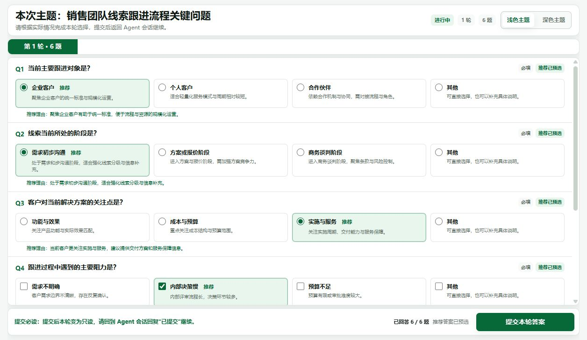

# AK Skills Sample

一个可直接安装到 Codex、Claude Code、Cursor 等 AI 编程助手中的 Agent Skills 示例仓库。

## Skill 是什么？

Skill 是给 AI Agent 使用的可复用能力包。它把一类任务需要遵循的说明、工作流程、参考资料和脚本放在同一个目录中，让 Agent 在遇到对应任务时知道应该如何稳定地完成。

一个 Skill 通常包含：

```text
skill-name/
├── SKILL.md       # 必需：用途、触发条件和执行流程
├── scripts/       # 可选：可执行脚本
├── references/    # 可选：协议、格式和参考资料
├── assets/        # 可选：页面、图片和静态资源
└── agents/        # 可选：Agent 展示和运行配置
```

安装后，Agent 可以通过两种方式使用 Skill：

- 显式调用：在 Codex 中输入 `$ask-ui`，明确要求使用该技能。
- 自动触发：当任务与 `SKILL.md` 中的 `description` 匹配时，由 Agent 自动选择。

## Ask UI

[`ask-ui`](skills/ask-ui/) 是一个面向 Agent 工作流的本地交互式提问工具。

当 Agent 一次需要确认多个相互独立的问题时，Ask UI 会把问题渲染成浏览器表单，预选推荐答案，并在用户提交后将结构化 JSON 结果返回给正在等待的 Agent。它适合需求澄清、方案配置、头脑风暴、计划制定和压力测试等场景。



### 它解决什么问题？

普通聊天适合逐个追问，但连续回答多项配置时容易遗漏上下文。Ask UI 将一轮中的多个独立问题集中展示，并保留 Session 和 Round 信息，使 Agent 可以：

- 一次收集多个答案，减少来回对话
- 为每个问题预选推荐项，同时允许用户修改
- 将问题和答案保存为便携 JSON
- 在同一任务中延续多轮提问，不覆盖历史答案
- 在前台等待中断时恢复已经提交的会话

只有一个问题，或者后续问题依赖前一题答案时，仍应直接在对话中逐个询问。

## 安装 Ask UI

安装前请确保终端可以运行 `node` 和 `npx`。

### 推荐：全局安装到 Codex

复制下面的命令并在任意终端中运行：

```bash
npx --yes skills@latest add Angus221/ak.skills_sample --skill ask-ui --global --agent codex --yes
```

全局安装后，Ask UI 可以在不同项目中使用。

### 仅安装到当前项目

进入目标项目目录后运行：

```bash
npx --yes skills@latest add Angus221/ak.skills_sample --skill ask-ui --agent codex --yes
```

项目级安装会将技能放入当前项目的 `.agents/skills/`，便于跟随项目共享。

### 交互式安装

如果希望由 CLI 自动检测本机的 AI Agent，并在安装过程中选择范围和安装方式：

```bash
npx skills@latest add Angus221/ak.skills_sample --skill ask-ui
```

### 检查是否安装成功

```bash
npx skills@latest list --global --agent codex
```

如果 `ask-ui` 出现在列表中，说明全局安装成功。Codex 通常会自动发现新技能；如果没有出现，请重启 Codex。

## 使用 Ask UI

安装后，可以直接向 Codex 描述一个包含多个待确认事项的任务：

```text
帮我规划这个产品功能，把需要确认的问题用 Ask UI 一次问我。
```

也可以显式调用：

```text
$ask-ui 请把这几个配置项整理成表单让我选择。
```

Ask UI 会启动本地页面并等待提交。提交后，Agent 会直接读取答案并继续原任务。

## 更新技能

```bash
npx skills@latest update ask-ui --global --yes
```

## 仓库中的其他技能

| 技能 | 目录 | 用途 |
| --- | --- | --- |
| Ask UI | [`skills/ask-ui/`](skills/ask-ui/) | 将多个独立问题渲染为本地交互表单，并返回结构化答案 |
| Resume Analyzer | [`skills/resume-analyzer/`](skills/resume-analyzer/) | 批量读取 PDF 简历，按岗位要求评分并生成 Excel 报告 |

## 开发与验证

验证 Ask UI：

```bash
node skills/ask-ui/scripts/self-test.mjs
```

查看仓库中可被 `skills` CLI 发现的技能：

```bash
npx --yes skills@latest add . --list
```

创建问题 JSON 前，请阅读 [`skills/ask-ui/references/schema.md`](skills/ask-ui/references/schema.md)。完整运行规范见 [`skills/ask-ui/SKILL.md`](skills/ask-ui/SKILL.md)。

## 参考资料

- [OpenAI：Build skills](https://developers.openai.com/codex/skills)
- [skills CLI 文档](https://www.skills.sh/docs/cli)
- [skills CLI GitHub 仓库](https://github.com/vercel-labs/skills)

## 许可证

当前仓库未包含 `LICENSE` 文件。如需以特定开源许可证发布，请在仓库根目录补充对应许可证文件。
